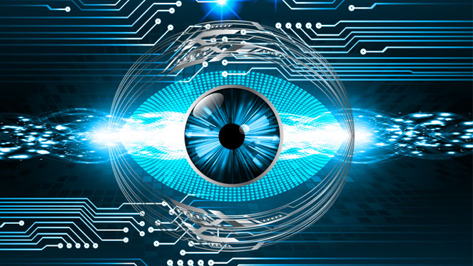

COMPUTER VISION 

  

## **Overview**
This repo contains books, courses, nanodegrees, and libraries that have helped me in my journey towards becoming an AI Engineer. Organization of content helps me to document my learning experience along the way. If the organization of content helps someone else in their journey then even better. Individual learnings of each of the below sections are within their respective README files 

# **Table Of Contents**

### **Books**
1. [Programming computer vision with python](https://www.amazon.com/Programming-Computer-Vision-Python-algorithms-ebook/dp/B008GCNGVE/ref=sr_1_3?dchild=1&keywords=computer+vision+python&qid=1589988582&sr=8-3)
2. [Learning OpenCV 3](https://www.amazon.com/Learning-OpenCV-Computer-Vision-Library-ebook/dp/B01MRXIYAN/ref=sr_1_16?dchild=1&keywords=computer+vision+python&qid=1590602680&sr=8-16)

### **Courses**
1. [Introduction to computer vision: Udacity]()
2. [Dr.Mubarak Shah: YouTube ]()

### **Nanodegrees**
1. [Computer vision: Udacity]()

### **Libraries**
1. [PyImageSearch]()
2. [OpenCV]()

